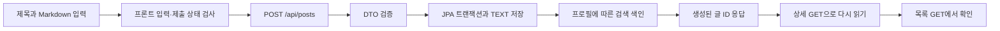

# 0004. 글을 검증하고 저장한 뒤 다시 읽기

- 상태: 구현·최신 환경 통합 검증 완료, PR 리뷰 대기
- PR: [#16](https://github.com/DolphaGo/board/pull/16)
- 후속 검증 기록: [#14](https://github.com/DolphaGo/board/issues/14)
- 선행 PR: [#13](https://github.com/DolphaGo/board/pull/13)
- 검증일: 2026-10-03

## 요구사항과 완료 조건

사용자가 제목과 Markdown 본문을 입력해 저장하고 상세·목록에서 같은 글을 다시 읽는다.

- 제목·본문이 공백뿐이면 프론트 요청을 보내지 않고, 직접 API 요청도 400으로 거절한다.
- 제목은 DB 계약에 맞춰 255자까지 받는다. Markdown 본문은 255자를 넘어도 그대로 저장한다.
- 저장 진행 중 재제출과 이미지 업로드 중 저장을 막는다.
- 저장 실패 시 입력을 보존하고 재시도할 수 있다.
- `study` 프로필에서는 검색 색인을 명시적으로 끄고 H2의 실제 저장·재조회를 학습한다. 기본 프로필의 색인은 유지한다.

## 구현 순서

1. 프론트 입력·진행 중 제출과 서버 HTTP 저장 계약을 실패 테스트로 고정한다.
2. 입력 계약과 저장 타입, study 색인 경계, 제출 상태를 최소 변경한다.
3. 최신 프론트·백엔드 도구 변경을 통합하고 전체 검증을 다시 실행한다.
4. 실제 API/브라우저로 입력 → 저장 → 상세 → 목록을 확인한다.

## 개념과 선택 이유

### 입력 검증과 DB 제약

프론트 검증은 입력 실수를 빨리 알려 주는 역할이다. 직접 API를 호출하면 프론트를 거치지 않으므로 서버도 계약을 검사해야 한다. [postEditorSubmit.ts](../../board-front/board-front-ui/src/components/postEditorSubmit.ts)는 빈 제목·본문과 긴 제목을 요청 전에 거절한다. [PostController](../../board-api/src/main/kotlin/dev/dolphago/controller/PostController.kt)의 `@Valid`, `@field:NotBlank`, `@field:Size(max = 255)`는 HTTP 요청의 DTO를 검증해 잘못된 입력을 400으로 응답한다. Kotlin의 `@field:`는 검증 annotation을 실제 필드에 적용하는 사용 지점 지정이다.

DB의 `nullable = false`는 NULL을 금지할 뿐 빈 문자열을 거절하지 않는다. 또한 기존 본문은 기본 VARCHAR(255)여서 긴 Markdown이 저장 단계에서 실패했다. [Post.kt](../../board-entity/src/main/kotlin/dev/dolphago/mysql/Post.kt)의 본문을 TEXT로 바꾸고 제목은 기존 255자 계약을 유지했다. 제목 제한은 문자열 길이 기준이며, 본문의 공백·개행·Markdown 원문은 저장할 때 보존한다.

### 비동기 제출 상태

[PostEditor.vue](../../board-front/board-front-ui/src/components/PostEditor.vue)의 `submitting`은 요청 중인지, `imageUploading`은 첨부 URL이 아직 준비되지 않았는지를 뜻한다. 버튼을 disabled로 표시하는 것과 함수 진입을 막는 것은 서로 다른 역할이다. DOM의 disabled가 반영되기 전 같은 tick에 이벤트가 두 번 발생할 수 있어 `submit()` 시작에서도 상태를 검사한다. 업로드가 끝나기 전에는 저장을 막아 첨부가 빠진 글로 이동하지 않게 한다.

저장 실패 시 화면 이동과 입력 초기화를 하지 않고 `finally`에서 제출 상태만 해제한다. 사용자는 같은 초안으로 재시도할 수 있다. 이 방어는 프론트의 동시 제출 방지이며, 서버의 멱등성 키나 네트워크 재전송 중복 방지를 구현한 것은 아니다.

### 원본 저장과 검색 색인

[PostService](../../board-api/src/main/kotlin/dev/dolphago/service/PostService.kt)는 DB 저장과 검색 색인을 수행한다. 기본 프로필에서 색인은 그대로 실행한다. [PostSearchIndexService](../../board-api/src/main/kotlin/dev/dolphago/search/PostSearchIndexService.kt)의 `board.search.indexing-enabled` 기본값은 true다. [study 설정](../../board-api/src/main/resources/application-study.yml)은 false로 명시해 H2 원본 저장을 외부 Elasticsearch 없이 학습할 수 있게 한다.

검색 연결 예외를 삼켜 저장 성공처럼 보이게 하는 대신 실행 모드로 동작을 선택했다. 따라서 study에서 저장한 글은 실제 DB에 있지만 Elasticsearch에 색인되지 않는다. 관련 글·검색·랭킹·채팅의 외부 인프라는 별도 학습 범위다.

## 요청 흐름과 읽는 순서

읽는 순서: `PostEditor.vue` → `postEditorSubmit.ts` → [postService.ts](../../board-front/board-front-ui/src/api/postService.ts) → `PostController` → `PostService` → `Post` → `PostSearchIndexService`. 테스트는 [PostEditor.spec.ts](../../board-front/board-front-ui/src/components/PostEditor.spec.ts), [제출 helper 테스트](../../board-front/board-front-ui/src/components/postEditorSubmit.spec.ts), [HTTP/H2 테스트](../../board-api/src/test/kotlin/dev/dolphago/controller/PostWriteApiIntegrationTest.kt), [색인 테스트](../../board-api/src/test/kotlin/dev/dolphago/search/PostSearchIndexServiceTest.kt)를 따라간다.

## 검증

실행 환경은 Node 26.10.0, pnpm 12.8.1, JDK 27, Gradle 9.8.0이다. TypeScript 7 native와 Vue 검사 도구의 공식 호환 API를 함께 사용한다.

| 검사 | 실제 결과 |
| --- | --- |
| 기존 구현의 실패 테스트 | 프론트 신규 7개, 서버 신규 5개 실패 재현 후 구현 |
| 최신 Vitest 이행 전 재현 | `jest is not defined`로 7개 실패 |
| `pnpm --dir board-front/board-front-ui test` | 28개 파일, 275개 통과 |
| 같은 폴더의 `pnpm build` | TypeScript 7 native·Vue 타입 검사와 Vite 빌드 통과 |
| 같은 폴더의 `pnpm lint` | 오류 0, 스타일 경고 494. 일괄 재서식은 하지 않음 |
| JDK 27의 `./gradlew test :board-api:bootJar :board-front:board-front-api:bootJar --no-daemon --max-workers=2` | 전체 Gradle 검증·두 실행 JAR 빌드 통과. API 102개 및 프론트 API 1개 테스트, 실패·오류·skip 0 |
| HTTP/H2 통합 테스트 | 빈 제목·공백 본문·256자 제목 400, 255자 제목과 1,495자 Markdown 생성→상세→목록 원문 일치 |
| 실제 API + 1440×1000 브라우저 | 빈 입력은 POST 0회. 255자 제목·1,663자 본문은 POST 1회, 상세·목록 원문 일치, 가로 넘침 없음 |
| 실제 API + 390×844 브라우저 | 1,370자 본문 저장·상세·목록 확인, 글쓰기·상세·목록 가로 넘침 없음 |
| 브라우저의 제어된 500 응답 | 초안 보존·버튼 재활성화. 주입 해제 후 실제 API 재시도·재조회 성공 |
| 제출·업로드 대기 테스트 | 같은 tick의 제출 두 번은 저장 요청 한 번. 업로드 완료 전 저장 차단, 완료 후 URL 반영 |

브라우저는 `study` API 19080과 `dev:api` Vite 14000을 연결했다. 500 응답만 Playwright로 주입했으며 성공 저장·재조회는 실제 H2/API를 사용했다. 외부 검색·랭킹 서비스의 실패와 기본 게시판 성공을 구분했다. 서버 종료 시 study 데이터는 사라진다.

## 실패와 해결

1. 기존 본문 VARCHAR(255) 제약 때문에 긴 글이 500으로 실패했다. TEXT로 변경한 뒤 HTTP 저장·재조회로 원문 보존을 확인했다.
2. 최초 테스트에서 `notice`를 생략하자 당시 JSON 역직렬화의 primitive 기본값 문제가 먼저 발생했다. 실제 프론트 payload처럼 `imageUrls`와 `notice`를 명시한 뒤 입력 검증의 실패를 재현해 잘못된 통과를 피했다.
3. 최신 테스트 도구와 글쓰기 커밋을 합친 뒤 새 테스트의 `jest.*` 호출 5곳이 남았다. GitHub CI와 로컬 실행에서 7개 실패를 확인했다. 이미 이행된 테스트와 같은 `vi.*`로 수정해 기존 단언을 유지하고 전체 275개 통과를 확인했다.

## 복습과 남은 범위

- 프론트 검사만으로 직접 API 요청을 막을 수 없는 이유는 무엇인가?
- NULL 제약, 빈 문자열 검증, VARCHAR 길이 제한은 어떻게 다른가?
- disabled 표시와 함수 진입 guard가 모두 필요한 이유는 무엇인가?
- study에서 원본 저장이 성공해도 실제 검색 색인 성공을 뜻하지 않는 이유는 무엇인가?

실제 로그인, 서버 멱등성, 외부 검색·채팅·이미지 저장소와 운영 DB 반영은 이 PR 범위가 아니다. CI의 최종 GitHub 러너 결과는 [#17](https://github.com/DolphaGo/board/pull/17)의 학습 기록에서 확인한다.
